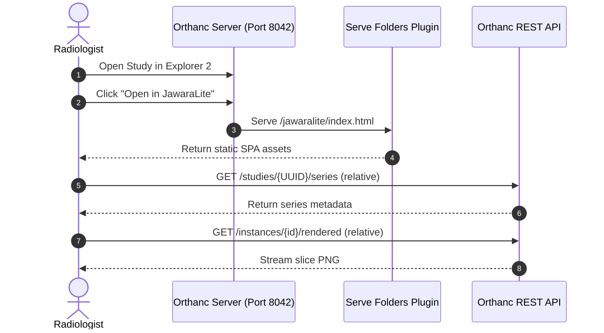

# JawaraLite Setup & Integration Guide

Welcome to the **JawaraLite Viewer** integration guide. This document outlines how to configure JawaraLite to run **without Python**, hosted directly by Orthanc using the **Serve Folders plugin**.

---

## 1. Architecture: Zero-Python Architecture (Orthanc Native)

In this mode, Orthanc itself hosts the static frontend assets via the **Serve Folders plugin**. The frontend queries the Orthanc REST API directly using relative paths.
- **No CORS issues** (since both the viewer and API share the exact same host and port).
- **No external server processes** needed to run the app.



---

## 2. Setup: Zero-Python Hosting (Orthanc Native)

### Step 1: Build the Frontend Assets
To host the files directly inside Orthanc, we compile the Vite source files into a static production bundle.

1. Navigate to the `frontend` directory:
   ```bash
   cd frontend
   ```
2. Build the project:
   ```bash
   npm run build
   ```
   This generates the compiled bundle in `frontend/dist/`. 
   
   *Note: Our `frontend/vite.config.js` is pre-configured with `base: './'` to ensure all compiled assets use relative pathing, allowing the viewer to be served under any subpath.*

---

### Step 2: Configure Orthanc to Serve the Folder

1. **Locate your Orthanc Configuration File:**
   Open the configuration file (usually `orthanc.json` or `configMacOS.json` in your Orthanc folder).

2. **Load the `Serve Folders` Plugin:**
   Add `"libServeFolders.dylib"` (or `.so` on Linux, `.dll` on Windows) to your `"Plugins"` list:
   ```json
   "Plugins": [
     "libOrthancExplorer2-universal.dylib",
     "libServeFolders.dylib",
     ...
   ]
   ```

3. **Configure Folder Mapping:**
   Add the `"ServeFolders"` configuration block at the root level of your Orthanc JSON config, mapping the `/jawaralite` path to your built `frontend/dist` directory:
   ```json
   "ServeFolders": {
     "/jawaralite": "/Volumes/Data 1/project-orthanc-viewer/frontend/dist"
   }
   ```

---

### Step 3: Add Launch Button to Orthanc Explorer 2

1. In the same configuration file, update the `"OrthancExplorer2"` block to add the custom action button:
   ```json
   "OrthancExplorer2": {
     "Enable": true,
     "IsDefaultOrthancUI": false,
     "UiOptions": {
       "CustomButtons": {
         "study": [
           {
             "Id": "open-in-jawaralite",
             "Title": "Open in JawaraLite",
             "Icon": "bi bi-eye",
             "Url": "../../jawaralite/index.html?study={UUID}",
             "HttpMethod": "GET",
             "Tooltip": "Open this study in JawaraLite"
           }
         ]
       }
     }
   }
   ```
   
   *Note: The relative URL `../../jawaralite/index.html?study={UUID}` is used so that the button works regardless of whether Orthanc is accessed via `localhost`, a local IP, or a domain name.*

2. **Restart your Orthanc server** to apply changes. 
3. Open your browser to `http://localhost:8042/jawaralite/index.html` to access the viewer directly, or click the eye icon inside Orthanc Explorer 2.

---

## 3. SIMRS Integration

SIMRS can open JawaraLite directly using the patient's Medical Record Number (`patientID`) and the examination's accession number (`accessionNumber`).

### URL Format:
```
http://localhost:8042/jawaralite/index.html?patientID={patientID}&accessionNumber={accessionNumber}
```

### How it works:
1. When the page is opened, the viewer automatically intercepts the `patientID` and `accessionNumber` parameters.
2. It queries the Orthanc `/tools/find` endpoint to locate the corresponding study UUID.
3. Once found, it updates the URL to `?study={studyId}` and loads the study details, patient history, and series.
4. If the accession number query fails to return a study, it falls back to listing all studies for the given `patientID`.

---
