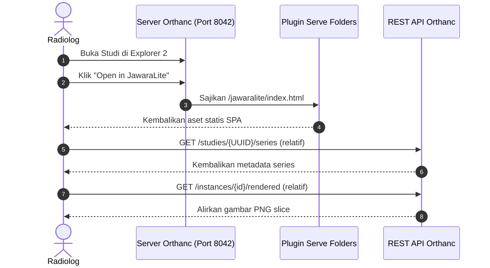

# Panduan Integrasi & Konfigurasi JawaraLite

Selamat datang di panduan integrasi **JawaraLite Viewer**. Dokumen ini menjelaskan cara mengonfigurasi JawaraLite agar dapat berjalan **tanpa Python**, di-host langsung oleh Orthanc menggunakan plugin **Serve Folders**.

---

## 1. Arsitektur: Arsitektur Zero-Python (Orthanc Native)

Dalam mode ini, Orthanc sendiri yang meng-host aset frontend statis melalui plugin **Serve Folders**. Frontend melakukan query langsung ke REST API Orthanc menggunakan jalur (path) relatif.
- **Bebas masalah CORS** (karena penampil dan API berjalan di host dan port yang sama).
- **Tanpa proses server eksternal** yang perlu dijalankan.



---

## 2. Setup: Hosting Zero-Python (Orthanc Native)

### Langkah 1: Build Aset Frontend
Untuk meng-host file secara langsung di dalam Orthanc, kita mengompilasi file sumber Vite menjadi bundel produksi statis.

1. Masuk ke direktori `frontend`:
   ```bash
   cd frontend
   ```
2. Build proyek:
   ```bash
   npm run build
   ```
   Ini akan menghasilkan bundel terkompilasi di dalam folder `frontend/dist/`. 
   
   *Catatan: Berkas `frontend/vite.config.js` kami telah dikonfigurasi sebelumnya dengan `base: './'` untuk memastikan semua aset terkompilasi menggunakan jalur relatif. Hal ini memungkinkan penampil untuk disajikan di bawah subpath mana pun.*

---

### Langkah 2: Konfigurasi Orthanc untuk Menyajikan Folder

1. **Temukan Berkas Konfigurasi Orthanc Anda:**
   Buka berkas konfigurasi (biasanya `orthanc.json` or `configMacOS.json` di dalam folder Orthanc Anda).

2. **Muat Plugin `Serve Folders`:**
   Tambahkan `"libServeFolders.dylib"` (atau `.so` untuk Linux, `.dll` untuk Windows) ke dalam daftar `"Plugins"` Anda:
   ```json
   "Plugins": [
     "libOrthancExplorer2-universal.dylib",
     "libServeFolders.dylib",
     ...
   ]
   ```

3. **Konfigurasikan Pemetaan Folder (Folder Mapping):**
   Tambahkan blok konfigurasi `"ServeFolders"` di tingkat root dari konfigurasi JSON Orthanc Anda, dengan memetakan path `/jawaralite` ke direktori build `frontend/dist` Anda:
   ```json
   "ServeFolders": {
     "/jawaralite": "/Volumes/Data 1/project-orthanc-viewer/frontend/dist"
   }
   ```

---

### Langkah 3: Tambahkan Tombol Peluncur ke Orthanc Explorer 2

1. Di berkas konfigurasi yang sama, perbarui blok `"OrthancExplorer2"` untuk menambahkan tombol aksi kustom:
   ```json
   "OrthancExplorer2": {
     "Enable": true,
     "IsDefaultOrthancUI": false,
     "UiOptions": {
       "CustomButtons": {
         "study": [
           {
             "Id": "open-in-jawaralite",
             "Title": "Open in JawaraLite",
             "Icon": "bi bi-eye",
             "Url": "../../jawaralite/index.html?study={UUID}",
             "HttpMethod": "GET",
             "Tooltip": "Open this study in JawaraLite"
           }
         ]
       }
     }
   }
   ```
   
   *Catatan: URL relatif `../../jawaralite/index.html?study={UUID}` digunakan agar tombol ini berfungsi baik ketika Orthanc diakses via `localhost`, IP lokal, maupun nama domain.*

2. **Restart server Orthanc Anda** untuk menerapkan perubahan. 
3. Buka browser Anda ke `http://localhost:8042/jawaralite/index.html` untuk mengakses penampil secara langsung, atau klik ikon mata di dalam Orthanc Explorer 2.

---

## 3. Integrasi dengan SIMRS

SIMRS dapat membuka JawaraLite secara langsung menggunakan Nomor Rekam Medis pasien (`patientID`) dan nomor aksesi pemeriksaan (`accessionNumber`).

### Format URL:
```
http://localhost:8042/jawaralite/index.html?patientID={patientID}&accessionNumber={accessionNumber}
```

### Cara Kerja:
1. Saat halaman dibuka, JawaraLite mendeteksi parameter `patientID` dan `accessionNumber`.
2. Melakukan query otomatis ke endpoint Orthanc `/tools/find` untuk mendapatkan UUID studi yang cocok.
3. Setelah UUID ditemukan, penampil menyinkronkan URL menjadi `?study={studyId}` secara senyap dan memuat daftar series serta riwayat pemeriksaan pasien.
4. Jika pencarian berdasarkan nomor aksesi tidak membuahkan hasil, sistem akan mendegradasi secara otomatis untuk memuat seluruh daftar riwayat studi milik `patientID` tersebut sebagai alternatif.

---
